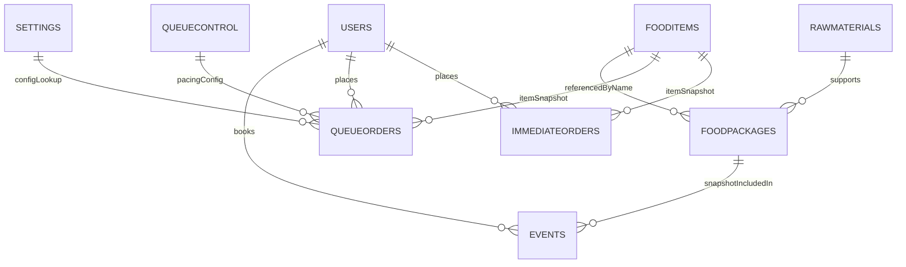

# DATABASE ERD AND RELATIONSHIP

This document describes the MongoDB collections, field shapes, relationships, and important behaviors implemented by the backend server: [CentralCafetariaServer/index.js](CentralCafetariaServer/index.js#L1).

> Generated from the actual backend code. Use the mermaid ERD block below for diagrams.

---

## ER Diagram (Mermaid)

---

## Collections, Fields & Examples
Below each collection lists core fields observed in `CentralCafetariaServer/index.js` and short notes about usage.

### `Users`
Core fields
- `_id`: ObjectId
- `name`: string
- `registrationNumber`: string (optional)
- `email`: string
- `id`: string (business/ID)
- `role`: string (`student|staff|teacher|admin`)
- `password`: string (bcrypt hash)
- `qrCodeString`: string
- `idCardFrontUrl`, `idCardBackUrl`: string
- `verified`: boolean
- `coins`: number
- `cart`: array of item snapshots (see example below)
- `coinIncreaseRequests`: array of `{ requestId, amount, status, requestedAt, approvedAt, approvedBy }`
- `privileged`: boolean
- `isadmin`: boolean
- `isSuperAdmin`: boolean
- `createdAt`, `updatedAt`: date

Cart item snapshot example
{
  name: "Roast Chicken",
  price: 120,
  unit: 1,
  category: "Lunch",
  quantity: 1,
  image: "..."
}

Notes: `cart` is read during `POST /order/queue` and cleared after order placement. Coin balance (`coins`) updated by coin endpoints and refunded on cancellations when `paidWithCoins` is true.

---

### `FoodItems`
Core fields
- `_id`: ObjectId
- `name`: string
- `price`: number
- `category`: array[string]
- `stock`: number
- `availability`: object (e.g., `{Breakfast:true, Lunch:false}`)
- `image`: string
- `unit`: string
- `rating`: number
- `createdAt`, `updatedAt`: date

Notes: `availability` is updated via `/foods/:id/availability`. Backend queries `FoodItems` by `name` when validating cart items.

---

### `FoodPackages`
Core fields
- `_id`: ObjectId
- `name`: string
- `price`: number
- `items`: array of `{ name: string, quantity: number }`
- `createdAt`, `updatedAt`: date

Notes: `FoodPackages` are used by event bookings; event documents embed package snapshots to preserve price/composition.

---

### `Events`
Core fields
- `_id`: ObjectId
- `name`: string (requester)
- `id`: string (requester identifier)
- `email`: string
- `department`: string
- `phone`: string
- `eventDate`: date (stored/used as toDate conversion in analytics)
- `selectedPackage`: object snapshot of a `FoodPackage`
- `packageQuantity`: number (string->int conversions occur in aggregations)
- `status`: string (`pending|confirmed|cancelled`)
- `paymentStatus`: string (`paid|unpaid|refunded`)
- `cancelledBy`, `cancelReason`, `cancelledAt`: metadata
- `createdAt`, `updatedAt`: date

Notes: Endpoints: `POST /events`, `GET /events`, `PATCH /events/:id/payment-status`, `PATCH /events/:id/cancel`, `GET /api/events/range`, `GET /api/events/analytics-range`.

---

### `QueueOrders` (collection name constant used by server)
Core fields
- `_id`: ObjectId
- `token`: string (format `TK-YYYYMMDD-XYZ`)
- `queueId`: number
- `userId`: ObjectId
- `customer_name`: string
- `items`: array of item snapshots
- `orderDetails`: duplicate array for analytics (server uses `$size` on this field)
- `created_at`, `placedAt`: date
- `status`: string (`Placed|Ready|Completed|Cancelled`)
- `queue_position`: number (nullable)
- `estimated_waiting_minutes`: number
- `totalPrice`: number
- `paidWithCoins`: boolean
- `privilegeUsed`: boolean
- `tableNumber`: string|null
- `counter`: string|null
- `completed_at`: date|null
- `updatedAt`: date

Behavioral notes: Queue position and estimated waiting are recalculated by `refreshQueuePositions()` using `QueueControl.minutesPerOrder`; teachers are inserted into `ImmediateOrders` instead of `QueueOrders` and marked `Ready`.

---

### `ImmediateOrders`
Same schema as `QueueOrders`. Used for teacher/priority orders that bypass the main queue.

---

### `RawMaterials`
Core fields
- `_id`: ObjectId
- `name`: string
- `unit`: string
- `supplier`: string
- `currentStock`: number
- `minStock`: number
- `createdAt`, `updatedAt`: date

Notes: CRUD endpoints: `GET /raw-materials`, `POST /raw-materials`, `PUT /raw-materials/:id`, `PATCH /raw-materials/:id/stock`.

---

### `Settings`
Core fields
- `_id`: string (e.g., `coinSettings`)
- `value`: number (coin conversion rate)
- `lastUpdatedAt`: date

Notes: `GET /coin-value`, `POST /coin-value` used for coin conversion. Backend uses this value when computing coin payment and refunds.

---

### `QueueControl`
Core fields
- `_id`: string (`main`)
- `minutesPerOrder`: number
- `queueEnabled`: boolean
- `createdAt`, `updatedAt`: date

Notes: Ensured on startup via `ensureQueueControl()` and updated via `PATCH /queue-control`. Used by `refreshQueuePositions()`.

---

## Index recommendations (from server usage)
- `Users`: `{ email: 1 }`, `{ id: 1 }`, `{ qrCodeString: 1 }`
- `FoodItems`: `{ name: 1 }`, `{ category: 1 }`
- `Events`: `{ id: 1 }`, `{ eventDate: 1 }`
- `QueueOrders`: `{ userId: 1 }`, `{ status: 1 }`, `{ queue_position: 1 }`

---

## Endpoint → Collection Mapping (quick)
- `POST /register`, `POST /admins` → `Users`
- `POST /login-qr`, `POST /login`, `GET /adminlogin` → `Users`
- `GET/POST/PUT/DELETE /foods` → `FoodItems`
- `POST /food-packages`, `GET /food-packages`, `PUT/DELETE /food-packages/:id` → `FoodPackages`
- `POST /events`, `GET /events`, `PATCH /events/:id/*`, `GET /api/events/*` → `Events`
- `PATCH /add-to-cart`, `PATCH /cart/update-unit`, `GET /cart/:userId`, `DELETE /cart/:userId` → `Users.cart` operations
- `POST /order/queue`, `PATCH /order/:id/status`, `GET /queue*`, `GET /queue/token/:token` → `QueueOrders`, `ImmediateOrders`
- `GET/POST/PUT/PATCH /raw-materials` → `RawMaterials`
- `GET/POST /coin-value`, `POST /users/update-all-coin-balances` → `Settings` and `Users` coins
- `GET/PATCH /queue-control`, `GET /queue/stats` → `QueueControl`

---

## Special implementation details (from server)
- Order statuses are normalized using an `ORDER_STATUS` map (Placed, Ready, Completed, Cancelled).
- `generateUniqueQueueId()` and `generateUniqueToken()` create unique identifiers and tokens stored on `QueueOrders`.
- Teachers are considered special: if `user.role` is `teacher`, orders go to `ImmediateOrders` and get `Ready` status and `queue_position` 0.
- When `paidWithCoins` is used, backend deducts `Users.coins` using `Settings.coinSettings.value` as conversion; refunds for cancellations increment `Users.coins`.
- `refreshQueuePositions()` recalculates `queue_position` and `estimated_waiting_minutes` and performs a `bulkWrite` to update `QueueOrders`.
- Event analytics convert string `packageQuantity` to numbers in aggregations: `{$toInt: "$packageQuantity"}`.

---

## Migration / Usage notes
- Preserve order snapshots (items/orderDetails) when migrating data to avoid breaking analytics.
- Keep `FoodPackages` snapshots inside `Events` to guarantee historical accuracy.
- Index fields listed above for production performance.

---

## References
- Backend source: [CentralCafetariaServer/index.js](CentralCafetariaServer/index.js#L1)

---

File created by developer tooling for project documentation.
