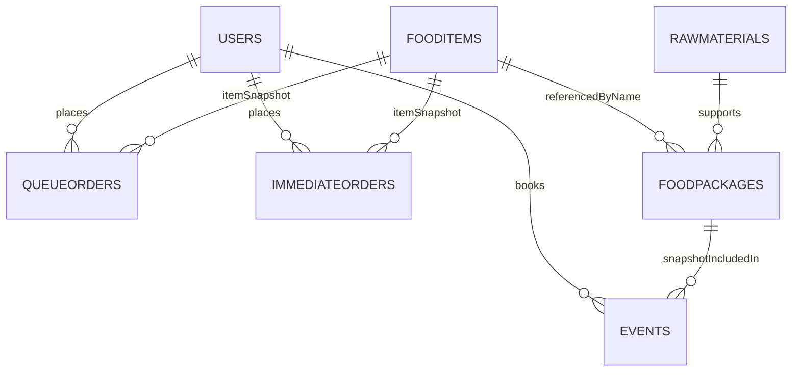

# Software Project Documentation

**Project Name:** [Your Project Name]

---

## 1. Abstract / Problem Statement

This report presents the design, development, and evaluation of **[Your Project Name]**, an academic software engineering project aimed at addressing the need for a modern, reliable, and efficient system to manage cafeteria operations. Traditional cafeteria workflows are often manual, time-consuming, and prone to errors. Inadequate menu management, limited order tracking, cash handling issues, and poor reporting reduce operational efficiency and customer satisfaction. This project proposes a web-based application that digitalizes ordering, inventory, staff management, and reporting processes.

---

## 2. Proposed Solution

The proposed solution is a full-stack web application that automates cafeteria management. It includes:
- end-user interfaces for students, teachers, and staff,
- an administrator dashboard for menu, stock, and order management,
- real-time reporting and analytics,
- secure authentication and authorization,
- responsive design for desktop and mobile access.

This system reduces manual paperwork, minimizes order errors, improves inventory control, and enables data-driven decisions.

---

## 3. Key Features

- User registration and authentication
- Role-based access control for students, teachers, staff, and administrators
- Food menu browsing, search, and category filtering
- Online ordering and cart management
- Inventory and stock level alerts
- Order tracking and history
- Sales reporting and analytics
- Admin tools for food package management and events
- Notification system for order status and stock shortages
- Responsive UI for multiple device types

---

## 4. Technologies Used

- Frontend: React, Tailwind CSS, HTML5, JavaScript
- Backend: Node.js, Express.js
- Database: MongoDB with native Node.js driver
- Authentication: bcrypt-based login, QR login, role/flag checks
- Deployment: Vercel / Heroku / AWS / Netlify
- Version Control: Git, GitHub
- Testing: Jest, React Testing Library, Postman

---

## 5. Expected Benefits

- Faster order processing and reduced waiting time
- Improved inventory accuracy and reduced waste
- Enhanced transparency in cafeteria operations
- Better tracking of sales and revenue
- Higher user convenience with online ordering
- Lower operational costs through automation

---

## 6. Acknowledgement

We extend our gratitude to:
- our academic supervisor for guidance and review,
- faculty members for technical support,
- peers for feedback during development,
- and family for encouragement.

Their support was crucial in completing this project successfully.

---

## 7. Introduction / Background

Modern cafeterias increasingly require software to replace manual record keeping. Universities face growing demand for faster service, accurate billing, and inventory management. This project builds on the trend toward digital transformation in campus services. It aims to deliver a cafeteria management platform that is scalable, maintainable, and user-friendly.

---

## 8. Problem Analysis

Key issues in current cafeteria processes include:
- manual order entry and invoicing,
- lack of real-time inventory visibility,
- no centralized reporting,
- poor coordination between service operations and other campus functions,
- difficulty managing menu changes and special events.

These problems lead to inefficiencies and customer dissatisfaction.

---

## 9. Objectives

Primary goals:
- Develop a web-based cafeteria management system
- Enable secure user authentication and role-based access
- Provide a smooth ordering workflow for customers
- Implement inventory monitoring and low-stock alerts
- Generate meaningful sales and inventory reports
- Ensure maintainable and extensible software architecture

---

## 10. Scope of the Project

In scope:
- UI for customers, including students, teachers, and staff, and administrators
- Order creation, modification, and cancellation
- Food and package management
- Inventory and stock alerts
- Sales reporting and order history
- Authentication and basic security

Out of scope:
- physical payment hardware integration
- payroll or human resource management
- advanced machine learning analytics
- multi-campus federation

---

## 11. Project Planning / Gantt Chart

### Gantt Chart (Sample)

| Week | Activity |
|------|----------|
| 1-2 | Requirement gathering, stakeholder analysis, SRS |
| 3-4 | System design, architecture, database design |
| 5-7 | Frontend development: UI screens and navigation |
| 8-10 | Backend development: API and data models |
| 11-12 | Integration and testing: unit and system tests |
| 13 | User acceptance testing, bug fixes |
| 14 | Documentation, deployment, final presentation |

---

## 12. Work Breakdown Structure (WBS)

### WBS Sample

1. Project Initiation
   1.1 Requirement analysis
   1.2 Feasibility study
2. System Design
   2.1 Architecture design
   2.2 Database modeling
3. Development
   3.1 Frontend implementation
   3.2 Backend implementation
   3.3 API development
4. Testing
   4.1 Unit testing
   4.2 Integration testing
   4.3 System testing
5. Deployment
   5.1 Environment setup
   5.2 Deployment
6. Documentation
   6.1 Report writing
   6.2 User manuals

---

## 13. Development Methodology

The project follows an **Agile-inspired incremental development** process with iterative sprints. Key practices:
- user stories and backlog refinement,
- sprint planning and reviews,
- continuous integration,
- modular design,
- peer code reviews,
- regular testing throughout development.

This methodology supports flexibility and early validation.

---

## 14. Software Requirement Specification (SRS) / Functional Requirements

Functional requirements:

- FR1: The system shall allow users to register and log in.
- FR2: The system shall allow users to browse food categories and items.
- FR3: The system shall allow users to add food items to a cart.
- FR4: The system shall allow users to place orders and view order status.
- FR5: The system shall allow administrators to manage food items and stock.
- FR6: The system shall generate sales and inventory reports.
- FR7: The system shall allow administrators to manage user roles.
- FR8: The system shall send notifications for low stock alerts.

---

## 15. Non-Functional Requirements

Non-functional requirements:

- NFR1: The system shall respond to user actions within 2 seconds.
- NFR2: The system shall be available 99.5% during operating hours.
- NFR3: The system shall secure user passwords and sensitive data.
- NFR4: The system shall support at least 200 concurrent users.
- NFR5: The user interface shall be responsive on desktop and mobile devices.
- NFR6: The system shall be maintainable with modular code structure.

---

## 16. Hardware Requirements

- Development machine: Intel i5 / AMD Ryzen 5, 8GB RAM, 256GB SSD
- Deployment server: 2 vCPU, 4GB RAM, 20GB storage
- Optional: Backup storage or cloud instance for production

---

## 17. Software Requirements

- Operating System: Windows 10/11, macOS, or Linux
- Node.js >= 18.x
- npm / yarn
- Database: MongoDB / PostgreSQL / MySQL
- Browser: Chrome, Firefox, Edge
- IDE: VS Code
- Postman for API testing

---

## 18. User Roles and Permissions

### Roles

- Administrator
- Teacher
- Staff
- Student

### Permissions

- Administrator: manage users, manage menu, monitor system status, view reports, configure system settings
- Teacher: view menu, place orders, view order history, update profile
- Staff: view menu, place orders, view order history, update profile
- Student: view menu, place orders, view order history, update profile

Note: In this project, university staff and teachers are modeled as customer users in the ordering workflow and do not have a separate service role.

---

## 19. Technology Stack / Frontend Technologies

- React for component-based UI
- Tailwind CSS for styling
- HTML5 and CSS3 for layout and presentation
- JavaScript ES2024 for client-side logic
- Axios or Fetch API for HTTP requests

---

## 20. Backend Technologies

- Node.js runtime
- Express.js web framework
- RESTful API design
- Middleware for authentication, validation, and error handling
- Logging with Winston or Morgan

---

## 21. Database Technologies

- MongoDB for document storage or
- PostgreSQL / MySQL for relational data
- Mongoose ORM (for MongoDB) or Sequelize / Prisma (for SQL)
- Schema design for users, products, orders, stock, events

---

## 22. Authentication & Security Technologies

- JSON Web Tokens (JWT) for session management
- bcrypt for password hashing
- User verification through stored credentials and QR codes
- HTTPS for encrypted transport
- Role and flag-based access checks (`isadmin`, `verified`, `privileged`)
- Input validation and sanitization
- Secure headers via Helmet

> Note: the current backend implementation returns authenticated user context directly and does not issue JWT tokens in `CentralCafetariaServer/index.js`.

---

## 23. Deployment Technologies

- Vercel / Netlify for frontend hosting
- Heroku / AWS Elastic Beanstalk / DigitalOcean for backend
- GitHub Actions for CI/CD
- Docker for containerization (optional)
- Cloud database service or managed DB instance

---

## 24. System Analysis & Design / System Architecture

### Architecture Overview

The system uses a **three-tier architecture**:
- Presentation Layer: React frontend
- Business Logic Layer: Node.js / Express backend
- Data Layer: MongoDB document store

Backend responsibilities:
- manage user profiles, authentication, and role state
- validate and persist cart snapshots, queue orders, and immediate orders
- process event booking requests and maintain booking lifecycle state
- serve audit-safe snapshots for menu items and package definitions
- support inventory data for raw materials and food availability
- provide configuration data for coin conversion and queue timing
- deliver analytics for paid event bookings and date-range queries

Communication:
- frontend ↔ backend over REST endpoints
- backend ↔ MongoDB via the native MongoDB driver (not ORM)
- user-facing access control is implemented through request handlers that check stored user flags such as `isadmin`, `role`, `privileged`, and `verified`

Persistence design:
- orders and events are intentionally denormalized for stable history and fast reads
- `FoodPackages` and `Events.selectedPackage` embed package snapshots instead of live references
- `Users.cart` is stored as an embedded item snapshot array, then cleared after an order is placed
- `Settings` and `QueueControl` collections offer global configuration for brokers such as coin value and queue pacing

---

## 25. Use Case Diagram & Detailed Use Cases

Below is a comprehensive, actionable use-case view covering all major actors and flows in the system. It includes a mermaid use-case diagram and detailed, testable use case descriptions with mappings to the implementation.

```mermaid
usecaseDiagram
actor Customer as C
actor Administrator as A
actor SuperAdmin as S
actor System as Sys

C --> (Register)
C --> (Login)
C --> (Login via QR)
C --> (Browse Menu)
C --> (Search Menu)
C --> (Add to Cart)
C --> (Place Order)
C --> (View Order Status)
C --> (Cancel Order)
C --> (Book Event)
C --> (Request Booking)
C --> (Cancel Booking)
C --> (View Booking Status)
C --> (Confirm Payment)
C --> (View Event History)
C --> (Request Coin Top-up)

A --> (Manage Food Items)
A --> (Manage Food Packages)
A --> (Manage Events)
A --> (View Event Records)
A --> (Approve Coin Requests)
A --> (Manage Users)
A --> (Generate Reports)


S --> (Set Global Settings)

Sys --> (Send Notifications)
Sys --> (Run Analytics)
```

Detailed Use Cases (actor — brief flow — implementation mapping)

- **Register (Customer)** — user provides name, id/email, password, optional QR and ID images; server stores in `Users`. Mapping: `POST /register`, frontend `src/Components/Authentication/Registration.jsx`.

- **Login / Login via QR (Customer)** — credentials or QR token validated; returns user info. Mapping: `POST /login`, `POST /login-qr`, frontend `src/Components/Authentication/Login.jsx`.

- **Browse Menu / Search Menu (Customer)** — view categories and items, filter by category/keyword. Mapping: `GET /foods`, frontend components in `src/Components/Home/*`.

- **Add to Cart (Customer)** — add item snapshot to `Users.cart`. Mapping: `PATCH /add-to-cart`, cart UI in `src/Components/Shared/CartDrawer.jsx`.

- **Place Order (Customer / Teacher special case)** — place queue order or immediate order (teachers marked ready). Steps: validate cart, compute total, insert into `QueueOrders` or `ImmediateOrders`, clear `Users.cart`. Mapping: `POST /order/queue`.

- **View Order Status (Customer)** — customer polls order; system or administrator updates status. Mapping: `PATCH /order/:id/status`, queue UI `src/Components/Queue/Queue.jsx`.

- **Cancel Order (Customer/Admin)** — cancel before completion; if paid with coins refund logic runs. Mapping: `PATCH /order/:id/status` (cancel path) and refund endpoints that update `Users.coins`. 

- **Manage Food Items (Administrator)** — CRUD on menu items, update stock and availability. Mapping: `GET/POST/PUT/DELETE /foods`, admin UI `src/Components/Admin/FoodManagement/*`.

- **Manage Food Packages (Administrator)** — create/edit/delete packages used by events and bookings. Mapping: `POST /food-packages`, `PUT /food-packages/:id`, `DELETE /food-packages/:id`, UI `src/Components/Admin/Events/ManageFoodPackages.jsx`.

- **Manage Events (Administrator / Customer booking)** — admin creates/edits events and views records; customers book events with selected package snapshot stored in `Events`. Mapping: `POST /events`, `GET /events`, `PATCH /events/:id/payment-status`, `PATCH /events/:id/cancel`, frontend components `src/Components/Admin/Events/*`, `src/Components/Home/EventBookingModal.jsx`.

- **View Event Records (Administrator)** — list bookings, revenue analytics. Mapping: `GET /api/events/analytics-range`, admin UI `src/Components/Admin/Events/EventRecords.jsx`.

- **Request & Approve Coin Top-up (Customer / Administrator)** — customers submit coin requests stored inside `Users.coinIncreaseRequests`; admin approves and increments `Users.coins`. Mapping: `POST /users/:id/coin-request`, `PATCH /users/:userId/coin-requests/:requestId`.

- **Manage Users (Administrator / SuperAdmin)** — CRUD user accounts, set privileged/superadmin flags. Mapping: `GET /users`, `POST /admins`, `PATCH /users/:id/privileged`, `PATCH /users/:id/superadmin`, `DELETE /users/:id`.

- **Queue Management (System / Administrator)** — view current queue, estimate waiting minutes, bulk-update positions and statuses. Mapping: queue helpers in server and endpoints under `/order` and queue broadcast logic; UI `src/Components/Queue/Queue.jsx` and server functions in `CentralCafetariaServer/index.js`.

- **Inventory & Raw Materials (Administrator)** — manage raw materials and current stock, trigger low-stock alerts. Mapping: `GET/POST/PUT /raw-materials`, `PATCH /raw-materials/:id/stock`.

- **Reporting & Analytics (Administrator / System)** — sales, events revenue and other metrics. Mapping: `GET /api/events/analytics-range`, other reports endpoints in server.

Event handling use cases (detailed flows)

- **Create Event (Administrator)**
   - Preconditions: admin authenticated; venue and basic package definitions exist.
   - Main flow: admin opens event create UI → enters event metadata (title, venue, dates, capacity, packages, deposit policy) → submits → server validates and saves `Events` document with `status: pending` or `approved` depending on policy.
   - Alternate: missing required fields → return validation errors; venue conflict → mark as conditional or reject.
   - Postconditions: event stored; notifications sent to configured channels if required.
   - Mapping: `POST /events`; UI `src/Components/Admin/Events/Events.jsx`.

- **Approve / Reject Event (Administrator / Event Coordinator)**
   - Preconditions: event exists in `pending` state.
   - Main flow: coordinator reviews details → approves or rejects → server updates `Events.status` and `approvalStatus` and sets `updatedAt` and optionally `depositRequired`.
   - Alternate: request changes — system records a comment and notifies requester.
   - Postconditions: event moves to `approved` or `rejected`; if approved, booking opens and invoice can be generated.
   - Mapping: `PATCH /events/:id` (admin update), notifications via system.

- **Request Booking / Book Event (Customer)**
   - Preconditions: event is `approved` and booking window open; customer authenticated or provides contact info.
   - Main flow: user opens `EventBookingModal` → selects package and quantity → system checks package availability and capacity → if checks pass, server inserts event booking in `Events` collection (or a linked `EventBookings` subdocument), sets `paymentStatus: unpaid` and returns booking id.
   - Alternate: insufficient package availability → show error and suggest alternatives; capacity exceeded → place on waitlist or reject.
   - Postconditions: booking recorded; deposit/payment flow initiated if configured.
   - Mapping: `POST /events` (current server stores bookings in `Events`) and frontend `src/Components/Home/EventBookingModal.jsx`.

- **Confirm Payment / Capture Deposit (Finance/Admin)**
   - Preconditions: booking exists with `paymentStatus: unpaid`.
   - Main flow: payment processor callback or manual admin update → server updates `paymentStatus: paid`, records `depositAmount` and `depositPaid` and updates `Events` booking entry.
   - Alternate: payment failure → `paymentStatus: unpaid`, notify user.
   - Postconditions: booking confirmed; stock reservation may be triggered.
   - Mapping: `PATCH /events/:id/payment-status`.

- **Reserve Stock & Allocate Fulfilment Tasks (System / Administrator)**
   - Preconditions: booking confirmed (paid or deposit accepted).
   - Main flow: system computes required raw materials from selected package quantities → reserves (decrements) `RawMaterials.currentStock` or creates reservations → creates fulfilment tasks and procurement requests for administrators to action.
   - Alternate: insufficient raw materials → flag low-stock and notify admin for procurement.
   - Postconditions: materials reserved; fulfilment tasks recorded.
   - Mapping: server-side reservation logic; update `RawMaterials` via `PATCH /raw-materials/:id/stock`. 

- **Cancel Booking (Customer / Admin)**
   - Preconditions: booking exists and not completed.
   - Main flow: customer or admin triggers cancel → server checks cancellation policy and payment status → if refund eligible, update `paymentStatus`/refund and optionally increment `RawMaterials` back if already reserved → set `status: cancelled` and record `cancelReason`, `cancelledAt`.
   - Alternate: cancellation window passed → partial/no refund.
   - Postconditions: booking cancelled; notifications sent and inventory adjusted if applicable.
   - Mapping: `PATCH /events/:id/cancel`.

- **Record Attendance & Post-event Reconciliation (Admin)**
   - Preconditions: event executed.
   - Main flow: admin records `confirmedAttendees`, actual consumption, final invoice adjustments → server stores final counts and generates post-event report (revenue, cost, staff hours).
   - Postconditions: `Events` updated with `confirmedAttendees`, `finalized: true`, and analytics available.
   - Mapping: admin UI and `PATCH /events/:id`.

- **Event Analytics & Revenue Reporting (System/Admin)**
   - Preconditions: events and bookings exist with payment data.
   - Main flow: system aggregates `Events` between selected dates, sums revenue using `packageQuantity * selectedPackage.price`, counts bookings and generates metrics.
   - Mapping: `GET /api/events/analytics-range`.

These additions make the use-case section actionable for testing and implementation planning. If you'd like, I can now:
- generate OpenAPI specs for the event-related endpoints,
- implement server-side validation and reservation logic for events,
- or create Postman test collections for these flows.

Design notes & how to use this section

- Each use case above can be expanded into test cases (preconditions, main flow, alternate flows). Use the mapped endpoints and components to derive API-level and UI-level tests.
- If you want, I can convert these use cases into an OpenAPI-driven contract or generate a set of executable Postman collections / tests next.

---

## 26. Activity Diagram Description

### Overview

This section formalizes the main activity flows of the system (ordering, event booking, and inventory/fulfilment). Activity diagrams show the sequence of actions, decision points, parallel tasks, and the responsibilities of each actor (swimlanes). Use these diagrams to derive UI behaviour, API contracts, and test cases.

### Swimlanes

- Customer (user on frontend) — includes students, teachers, and staff who use the app as customers
- Frontend (UI / Client app)
- Backend (API / business logic)
- Order Processing / Fulfilment (system / admin)
- Inventory / Procurement
- Administrator / Finance

### Key Activities & Decision Points

- Browse Menu → Add to Cart: user selects items or packages.
- Checkout → Validate Cart: backend checks prices and current stock.
- Payment Decision: immediate payment vs coin-balance vs unpaid (invoice/deposit).
- Order Routing: immediate orders vs queued orders (teachers shortcut).
- Reservation: for events, after payment confirm reserve raw materials and allocate staff.
- Cancellation & Refund: policy check, adjust inventory and coins if required.

These decision points determine alternate flows (e.g., out-of-stock, payment failure, capacity exceeded).

### Example Activity Flows (detailed)

- Place Order (Customer):
   1. Customer authenticates.
   2. Customer browses and adds snapshots to cart.
   3. Customer checks out; frontend sends order to backend.
   4. Backend validates cart and checks stock.
5a. If stock OK → process payment; on success save to `ImmediateOrders` or `QueueOrders` and notify order processing (system/admin).
   5b. If stock insufficient → return error/suggest alternatives.
   6. Post-order: update user view and send notifications.

- Book Event (Customer → Admin approval flow):
   1. Customer submits booking (selected package snapshot stored).
   2. Backend checks event capacity and package availability.
3a. If approved/paid → set `paymentStatus: paid`, reserve materials, notify administrators/order-processing.

### Mermaid Flow Example

```mermaid
flowchart TD
      CU[Customer] -->|Open Menu| FE[Frontend]
      FE -->|Add to Cart| CART[Cart]
      CART -->|Checkout| BE[Backend]
      BE --> STOCK{Stock available?}
      STOCK -- No --> OUT[Notify: Out of stock]
      STOCK -- Yes --> PAY[Process Payment]
      PAY --> POK{Payment success?}
      POK -- No --> PFAIL[Notify: Payment failed]
      POK -- Yes --> SAVE[Save Order (Queue / Immediate)]
      SAVE --> NOTIFY[Notify Order Processing]
      NOTIFY --> ORDERPROC[Order Processing / Admin]

      %% Event booking path
      CU -->|Open Event Modal| EB[EventBooking]
      EB -->|Submit Booking| BE
      BE --> CAP{Capacity available?}
      CAP -- No --> WAIT[Add to Waitlist / Reject]
      CAP -- Yes --> PEND[Set status: pending / unpaid]
      PEND -->|Admin Approves| APPR{Approved?}
      APPR -- Yes --> RESERVE[Reserve Materials & Confirm]
      RESERVE --> NOTIFY
```

### Implementation & Testing Notes

- Map each activity step to API endpoints (e.g., `POST /order/queue`, `POST /events`, `PATCH /events/:id/payment-status`).
- Derive test cases from decision points: out-of-stock, payment failure, capacity exceeded, cancellation windows.
- For event bookings, ensure reservation and rollback logic is covered by tests (reserve on payment, release on cancellation).
- Consider adding explicit activity diagrams for long-running processes (stock procurement, post-event reconciliation) and rendering the mermaid diagrams as images for reports.

These expanded descriptions make the activity flows actionable for development, testing, and operations.

---

## 27. Sequence Diagram Description

### Sequence Description

The sequence diagram documents the timed interactions between the main participants for key workflows. It makes explicit the message order, synchronous vs asynchronous steps, and how the frontend, backend, database, and external systems collaborate.

Example order creation sequence:
1. Customer opens the menu page and requests food catalog data from the frontend.
2. Frontend sends `GET /foods` to the backend.
3. Backend fetches `FoodItems` from MongoDB and returns the catalog.
4. Customer adds items to the cart and submits checkout.
5. Frontend sends `POST /order/queue` with the cart payload and user token.
6. Backend validates the cart, checks stock, computes totals, and stores the order in `QueueOrders` or `ImmediateOrders`.
7. Backend sends an order confirmation response and triggers order-processing notifications.
8. Frontend updates the user view with order status and history.

This description highlights the role of request validation, state persistence, and feedback loops between UI and API.

---

## 28. Class Diagram Description

### Class Description

The class diagram captures the main domain entities, their attributes, and their relationships. It is particularly useful for visualizing how customer actions map to persisted data and service boundaries.

Key entities and relationships:
- `User`: contains authentication data, role, contact details, coins, and cart contents.
- `FoodItem`: represents a menu item with category, pricing, stock, availability, and metadata.
- `FoodPackage`: groups multiple food item quantities into a reusable package used for event bookings.
- `Order`: models a placed customer order with user reference, item snapshots, total price, status, and fulfillment metadata.
- `Event`: models an event booking with requester details, selected package snapshot, booking quantity, capacity, payment status, and lifecycle state.
- `RawMaterial`: tracks inventory needed to fulfill food packages and event bookings.

Important relationships:
- `User` 1 — * `Order` and `Event`
- `Order` embeds `OrderItem` snapshots to preserve price and quantity at order time.
- `Event` embeds `FoodPackage` snapshots to preserve package details for historical bookings.
- `FoodPackage` contains an array of package item quantities that map conceptually to `FoodItem` entries.

This description enables a developer to convert the domain model into a class diagram that reflects both user-facing workflows and backend persistence.

---

## 29. Flow Chart Description

### Flow Chart Narrative

The flow chart describes the full system process from user initiation through backend processing to final response. It highlights decision nodes and alternate branches, making it easy to identify where validation and error handling occur.

High-level flow:
- Start: user authenticates or proceeds as a logged-in customer.
- Menu browsing: user selects food items or event packages.
- Add to cart: selected items are assembled with current prices and quantities.
- Checkout decision: user chooses immediate order, queued order, or event booking.
- Backend validation: the system validates user identity, cart contents, stock levels, package availability, and event capacity.
- Payment decision: the flow branches based on payment success, coin balance, or unpaid reservation.
- Persistence: on success, the system saves the order/event and updates inventory or reservations.
- Notification: the user receives confirmation and the admin/order-processing side receives fulfilment tasks.
- End: the flow terminates with a success or failure state, enabling async follow-up for cancellations or updates.

This flowchart narrative makes the overall process clear and supports compiling more detailed diagrams for each major workflow.

---

## 30. Best Database Schema

This section defines the authoritative MongoDB schema for the cafeteria project, aligned with the actual backend implementation in `CentralCafetariaServer/index.js`. It includes every database collection used by the server and describes the important field shapes for user records, menu items, packages, bookings, queue workflows, and global settings.

### Design Principles
- Separate user profile/authentication data from transactional and history data.
- Preserve cart, order, and event snapshots for auditability and stable history.
- Optimize read-heavy workflows such as menu browsing, order lookup, queue status, and analytics.
- Store global configuration in dedicated collections for easy runtime updates.
- Use separate collections for queued and immediate order workflows.

### Collections and Schema

#### Users
- `_id`: ObjectId
- `name`: string
- `registrationNumber`: string (optional student registration)
- `email`: string, unique
- `id`: string, unique business/government identifier
- `role`: string enum [`student`, `staff`, `teacher`, `admin`]
- `password`: string (bcrypt hash)
- `qrCodeString`: string, unique
- `idCardFrontUrl`: string
- `idCardBackUrl`: string
- `verified`: boolean
- `coins`: number
- `cart`: array of embedded cart item snapshots
- `coinIncreaseRequests`: array of `{ requestId, amount, status, requestedAt, approvedAt, approvedBy }`
- `privileged`: boolean
- `isadmin`: boolean
- `isSuperAdmin`: boolean
- `createdAt`: date
- `updatedAt`: date

Cart item snapshot example:
- `name`: string
- `price`: number
- `unit`: number
- `category`: string
- `quantity`: number
- `image`: string

Rationale: `Users` stores authentication state, wallet balance, pending cart contents, and coin request history. Embedding the cart simplifies checkout and reduces join complexity.

#### FoodItems
- `_id`: ObjectId
- `name`: string
- `price`: number
- `category`: array of strings
- `stock`: number
- `availability`: object mapping categories or time periods to booleans
- `image`: string
- `unit`: string
- `rating`: number
- `createdAt`: date
- `updatedAt`: date

Rationale: `FoodItems` is the menu catalog used for availability checks and menu browsing.

#### FoodPackages
- `_id`: ObjectId
- `name`: string
- `price`: number
- `items`: array of `{ name: string, quantity: number }`
- `createdAt`: date
- `updatedAt`: date

Rationale: `FoodPackages` defines bundled menu offerings used by events and package-based bookings.

#### Events
- `_id`: ObjectId
- `name`: string
- `id`: string
- `email`: string
- `department`: string
- `phone`: string
- `eventDate`: date
- `selectedPackage`: object snapshot of a `FoodPackage`
- `packageQuantity`: number
- `status`: string enum [`pending`, `confirmed`, `cancelled`]
- `paymentStatus`: string enum [`paid`, `unpaid`, `refunded`]
- `cancelledBy`: string
- `cancelledAt`: date
- `cancelReason`: string
- `createdAt`: date
- `updatedAt`: date

Rationale: `Events` stores booking requests and event records. Using package snapshots preserves the package price and composition at booking time.

#### QueueOrders
- `_id`: ObjectId
- `token`: string
- `queueId`: number
- `userId`: ObjectId
- `customer_name`: string
- `items`: array of item snapshots
- `orderDetails`: duplicate item snapshot for quick reads and analytics
- `created_at`: date
- `placedAt`: date
- `status`: string enum [`Placed`, `Ready`, `Completed`, `Cancelled`]
- `queue_position`: number
- `estimated_waiting_minutes`: number
- `totalPrice`: number
- `paidWithCoins`: boolean
- `privilegeUsed`: boolean
- `tableNumber`: string or null
- `counter`: string or null
- `completed_at`: date or null
- `updatedAt`: date

Rationale: `QueueOrders` captures the main queued order workflow, including status progression, wait estimates, and coin payment handling.

#### ImmediateOrders
- `_id`: ObjectId
- fields matching `QueueOrders`

Rationale: `ImmediateOrders` is used for teacher/priority orders that bypass the standard queue and are processed immediately.

#### RawMaterials
- `_id`: ObjectId
- `name`: string
- `unit`: string
- `supplier`: string
- `currentStock`: number
- `minStock`: number
- `createdAt`: date
- `updatedAt`: date

Rationale: `RawMaterials` supports inventory tracking and stock-alert workflows.

#### Settings
- `_id`: string (e.g. `coinSettings`)
- `value`: number
- `lastUpdatedAt`: date

Rationale: `Settings` holds global configuration values such as coin conversion rates.

#### QueueControl
- `_id`: string (e.g. `main`)
- `minutesPerOrder`: number
- `queueEnabled`: boolean
- `createdAt`: date
- `updatedAt`: date

Rationale: `QueueControl` stores queue pacing and enable/disable configuration.

### Recommended Indexes
- `Users`: `{ email: 1 }`, `{ id: 1 }`, `{ qrCodeString: 1 }`
- `FoodItems`: `{ name: 1 }`, `{ category: 1 }`
- `Events`: `{ id: 1 }`, `{ email: 1 }`, `{ eventDate: 1 }`
- `QueueOrders`: `{ userId: 1 }`, `{ status: 1 }`, `{ queue_position: 1 }`
- `ImmediateOrders`: `{ userId: 1 }`, `{ status: 1 }`

### Best Practice Notes
- Preserve snapshot data in orders and events for historical accuracy.
- Keep order documents append-only except for state updates.
- Store package snapshots inside `Events` instead of live package references.
- Keep global configuration in `Settings` and `QueueControl`.
- Use user flags like `privileged`, `isadmin`, and `verified` to drive access control.

### Conceptual ER Diagram


This schema fully reflects the current `CentralCafetariaServer` data model and the collections it manages.

---

## 31. Data Dictionary

The data dictionary below captures the primary collections and their core fields, matching the implemented MongoDB schema.

### Users
- `_id`: Unique ObjectId for each user.
- `name`: Full name.
- `registrationNumber`: Student registration number.
- `email`: Login email.
- `id`: Business/government identifier.
- `role`: User role.
- `password`: bcrypt-hashed password.
- `qrCodeString`: QR login credential.
- `verified`: Account verification flag.
- `coins`: Wallet balance.
- `cart`: Pending cart item snapshots.
- `coinIncreaseRequests`: Stored coin top-up requests.
- `privileged`: Privilege flag.
- `isadmin`: Admin flag.
- `isSuperAdmin`: Super admin flag.
- `createdAt`, `updatedAt`: Timestamps.

### FoodItems
- `_id`: Unique ObjectId.
- `name`: Menu item name.
- `price`: Item price.
- `category`: Categories.
- `stock`: Available quantity.
- `availability`: Availability map.
- `image`: Image URL.
- `unit`: Unit measure.
- `rating`: Rating score.
- `createdAt`, `updatedAt`: Timestamps.

### FoodPackages
- `_id`: Unique ObjectId.
- `name`: Package name.
- `price`: Package cost.
- `items`: Package item snapshots.
- `createdAt`, `updatedAt`: Timestamps.

### Events
- `_id`: Unique ObjectId.
- `name`: Requester name.
- `id`: Requester identifier.
- `email`: Requester email.
- `department`: Requester department.
- `phone`: Requester phone.
- `eventDate`: Requested date.
- `selectedPackage`: Package snapshot.
- `packageQuantity`: Quantity booked.
- `status`: Booking state.
- `paymentStatus`: Payment state.
- `cancelledBy`: Cancelling actor.
- `cancelledAt`: Cancellation timestamp.
- `cancelReason`: Cancellation reason.
- `createdAt`, `updatedAt`: Timestamps.

### QueueOrders and ImmediateOrders
- `_id`: Unique ObjectId.
- `token`: Order token.
- `queueId`: Queue identifier.
- `userId`: Customer reference.
- `customer_name`: Display name.
- `items`: Order item snapshots.
- `orderDetails`: Duplicate order snapshot.
- `created_at`, `placedAt`: Timestamps.
- `status`: Order state.
- `queue_position`: Queue position.
- `estimated_waiting_minutes`: Wait estimate.
- `totalPrice`: Order total.
- `paidWithCoins`: Coin payment flag.
- `privilegeUsed`: Privilege flag.
- `tableNumber`: Table assignment.
- `counter`: Selected counter.
- `completed_at`: Completion timestamp.

### RawMaterials
- `_id`: Unique ObjectId.
- `name`: Material name.
- `unit`: Unit measure.
- `supplier`: Supplier name.
- `currentStock`: Current quantity.
- `minStock`: Reorder threshold.
- `createdAt`, `updatedAt`: Timestamps.

### Settings
- `_id`: Settings document key.
- `value`: Coin conversion rate.
- `lastUpdatedAt`: Timestamp.

### QueueControl
- `_id`: Queue settings key.
- `minutesPerOrder`: Queue timing value.
- `queueEnabled`: Queue enable flag.
- `createdAt`, `updatedAt`: Timestamps.

For exact implementation details, consult the server source: [CentralCafetariaServer/index.js](CentralCafetariaServer/index.js#L1).

---

## 32. Relationships

### Key Relationships (detailed)

- `Users` → `Events`
  - Relationship: one-to-many
  - Description: each event booking stores requester contact details and permission to retrieve a user’s event history by matching `Users.id` or email. Booking lookups by user are served by `/users/:userId/events`.

- `Users` → `QueueOrders` / `ImmediateOrders`
  - Relationship: one-to-many
  - Description: orders reference the `Users` document via `userId`; the user document itself is not embedded to keep order snapshots stable.

- `Users.cart` → `FoodItems`
  - Relationship: embedded snapshot to referenced item
  - Description: user carts store a snapshot of the item name, price, and category rather than a live foreign key, so the order can be reconstructed even if the original menu changes.

- `FoodPackages` ↔ `FoodItems`
  - Relationship: implicit reference by item name
  - Description: packages are built from item name/quantity pairs and do not directly reference `FoodItems._id`, so package definitions are stable even if item ids change.

- `Events` ↔ `FoodPackages`
  - Relationship: embedded snapshot
  - Description: `Events.selectedPackage` stores the package payload to preserve the package price and structure at booking time.

- `QueueOrders` / `ImmediateOrders` ↔ `Settings`
  - Relationship: configuration lookup
  - Description: payment with coins is computed using `Settings.coinSettings.value`; queue wait times use `QueueControl.minutesPerOrder`.

- `RawMaterials` ↔ `FoodPackages`
  - Relationship: support mapping
  - Description: raw materials are the inventory layer that supports package fulfilment; the current server does not enforce direct referential integrity but the conceptual design maps package menus to raw material consumption.

---

## 33. System Implementation / Frontend Implementation

### Frontend Implementation

- Component-based UI using React
- Reusable components: Navbar, Footer, FoodCard, CartDrawer, Modal dialogs
- Context API for authentication and cart state
- Axios for API communication
- Responsive layout created with Tailwind CSS
- Forms with validation and error handling

---

## 34. Backend Implementation

### Backend Implementation

- Single-file Express.js server using the official MongoDB Node.js driver
- Serverless-optimized MongoDB connection caching to reuse a single client session
- `Users`, `FoodItems`, `FoodPackages`, `Events`, `QueueOrders`, `ImmediateOrders`, `RawMaterials`, `Settings`, and `QueueControl` collections
- Authentication endpoints for admin login, password login, and QR code login
- Registration endpoints for standard users and admin users
- Event booking endpoints with `pending` status, `unpaid` payment defaults, and admin cancellation workflows
- Queue order endpoint that reads cart snapshot data, validates availability, computes pricing, assigns queue position, and creates either `QueueOrders` or teacher `ImmediateOrders`
- Order handling includes coin payment validation, privilege usage, counter selection for staff and students, and cart clearing after placement
- Inventory endpoints for raw materials and food availability updates
- Analytics endpoints that aggregate paid events via MongoDB pipelines
- Settings endpoints for coin value configuration and bulk coin balance updates
- Analytics endpoints for event range queries and paid booking summaries

---

## 35. API Structure

### API Endpoints

- `POST /adminlogin` – authenticate a configured admin user
- `POST /login` – authenticate a user by `identifier` (email or id) and password
- `POST /login-qr` – authenticate a user by `qrCodeString`
- `POST /register` – register a new student, teacher, or staff user
- `POST /admins` – create a new backend administrator account
- `GET /foods` – fetch all menu items
- `PATCH /foods/:id/availability` – update category availability for a food item
- `PATCH /foods/set-all-available` – mark all food items available across categories
- `PATCH /add-to-cart` – add an item snapshot to a user’s cart
- `PATCH /cart/update-unit` – change quantity or remove an item from cart
- `GET /cart/:userId` – fetch a user’s cart
- `DELETE /cart/:userId` – clear a user’s cart
- `POST /order/queue` – place a queue order or immediate teacher order from cart
- `PATCH /order/:id/status` – update queue order status to `Ready`, `Completed`, or `Cancelled`
- `POST /events` – book an event with package snapshot and requested date
- `GET /events` – list all event bookings
- `PATCH /events/:id/payment-status` – update event payment status
- `PATCH /events/:id/cancel` – cancel an event booking
- `GET /api/events/range` – query events in a date range
- `GET /api/events/analytics-range` – aggregate paid booking analytics
- `GET /users/:userId/events` – fetch event bookings for a specific requester
- `GET /raw-materials` – list raw inventory materials
- `POST /raw-materials` – add a raw material record
- `PUT /raw-materials/:id` – update a raw material record
- `PATCH /raw-materials/:id/stock` – update raw material stock level
- `GET /coin-value` – fetch the current coin conversion setting
- `POST /coin-value` – update the coin conversion setting
- `POST /users/update-all-coin-balances` – bulk recompute coin balances when conversion value changes

---

## 36. Authentication Process

### Authentication Flow

1. User submits login credentials via `/login`.
2. Backend searches the `Users` collection by email or business/ID string.
3. Passwords are validated by comparing the submitted value with the stored bcrypt hash.
4. If the user is unverified, login is rejected.
5. Successful login returns a user object containing `id`, `email`, `name`, `role`, and `privileged` status.
6. Alternatively, `/login-qr` allows login by `qrCodeString` with the same verified-user check.
7. Admin login is handled separately at `/adminlogin` and checks `isadmin: true`.

> Note: the current backend implementation returns authenticated user context directly and does not issue JWT tokens in `CentralCafetariaServer/index.js`.

---

## 37. Major Functional Modules

### Modules

- Authentication and user profile module
- Menu and food availability module
- Cart management and order snapshot module
- Queue and immediate order workflow module
- Event booking and payment status module
- Inventory/raw materials management module
- System settings and coin conversion module
- Event analytics and report query module
- User profile module
- Notification module

Each module is designed for cohesion and separation of concerns.

---

## 38. Testing & Quality Assurance / Unit Testing

### Unit Testing

- Test individual frontend components and helper functions
- Test backend controllers and services
- Example tools: Jest, React Testing Library
- Coverage includes validation, state updates, API call behavior

---

## 39. Integration Testing

### Integration Testing

- Verify frontend and backend integration through API calls
- Test end-to-end order placement flow
- Validate authentication and protected route access
- Example tools: Jest + Supertest, Postman, Cypress

---

## 40. System Testing

### System Testing

- Full-stack testing of the deployed application
- Validate user workflows for all roles
- Test performance under simulated load
- Check UI responsiveness and compatibility across browsers

---

## 41. Test Cases with Expected Results

### Sample Test Cases

| Test Case | Description | Expected Result |
|-----------|-------------|-----------------|
| TC1 | Register new user | User account created, success message displayed |
| TC2 | Login with valid credentials | User object returned and dashboard accessible |
| TC3 | Add food item to cart | Cart updates with selected item |
| TC4 | Place order | Order stored in database, confirmation displayed |
| TC5 | Admin updates stock | Stock amount updated, low-stock alert if below threshold |

---

## 42. Security Testing

### Security Testing

- Verify password hashing and secure storage
- Test token expiration and refresh logic
- Validate role-based access restrictions
- Perform SQL/NoSQL injection testing on API endpoints
- Check XSS protection in frontend input handling
- Ensure HTTPS usage for sensitive endpoints

---

## 43. System Maintenance / Corrective Maintenance

### Corrective Maintenance

- Fix defects discovered during testing
- Patch backend bugs caused by invalid input
- Resolve UI issues affecting usability
- Update error handling for edge cases

Corrective maintenance ensures system reliability after deployment.

---

## 44. Adaptive Maintenance

### Adaptive Maintenance

- Update application to support new browser versions
- Migrate database or deployment platform as needed
- Add support for new authentication providers
- Modify system to comply with updated university policies

Adaptive maintenance keeps the system current with changing environments.

---

## 45. Perfective Maintenance

### Perfective Maintenance

- Optimize performance by reducing API latency
- Refactor code for readability and maintainability
- Improve UI design based on user feedback
- Add new features such as advanced filtering or reporting

Perfective maintenance enhances the quality and user experience over time.

---

## 46. Results and Discussion / Achievements

### Achievements

- Developed a fully functional cafeteria management system
- Implemented secure authentication and role management
- Automated order processing and inventory monitoring
- Delivered reporting tools for sales analytics
- Achieved responsive design across devices
- Demonstrated industry-standard best practices such as modular architecture, Agile development, and automated testing

---

## 47. Benefits

- Reduced manual effort and paper records
- Faster customer service and fewer order errors
- Better control over stock and menu updates
- Data-driven insights for cafeteria management
- Easier maintenance and future feature extension

---

## 48. Limitations

- Current system may need scaling improvements for very high traffic
- Offline access is not supported
- Payment integration with external gateways is not included
- Limited support for multiple cafeterias or campuses
- Real-time order processing display integration remains future work

---

## 49. Conclusion

This project successfully produced a usable, maintainable, and robust cafeteria management solution. It demonstrates effective application of software engineering practices, including requirement analysis, architecture design, full-stack development, testing, and documentation. The system can be adopted by academic cafeterias to improve service quality and operational efficiency.

---

## 50. Future Enhancements

Potential enhancements:
- Mobile native app support
- Payment gateway integration
- Real-time order tracking and order processing display
- Multi-campus or multi-outlet support
- Advanced analytics with predictive inventory planning
- Chatbot or voice ordering support

These improvements would extend the platform’s value and adaptability.

---

## 51. References

- Pressman, R. S. (2014). *Software Engineering: A Practitioner’s Approach*.
- Sommerville, I. (2016). *Software Engineering*.
- Fowler, M. (2002). *Patterns of Enterprise Application Architecture*.
- MDN Web Docs — HTML, CSS, JavaScript
- React official documentation
- Node.js and Express.js official documentation
- MongoDB / PostgreSQL / MySQL documentation

---

## 52. Events & Event Planning

The system supports event creation, management, booking, and event-related food package management to enable campus activities and catered events.

### Purpose
- Provide administrators tools to create and manage events and food packages.
- Allow users to view events, book participation, and view booking history.

### Key Features
- Admin event management (create / edit / cancel / capacity) — see [src/Components/Admin/Events/Events.jsx](src/Components/Admin/Events/Events.jsx).
- Event records and attendee lists — see [src/Components/Admin/Events/EventRecords.jsx](src/Components/Admin/Events/EventRecords.jsx).
- Manage food packages associated with events — see [src/Components/Admin/Events/ManageFoodPackages.jsx](src/Components/Admin/Events/ManageFoodPackages.jsx).
- User-facing booking modal — see [src/Components/Home/EventBookingModal.jsx](src/Components/Home/EventBookingModal.jsx).
- Event history and user bookings — see [src/Components/Shared/EventHistoryModal.jsx](src/Components/Shared/EventHistoryModal.jsx).

### Booking Flow (example)
- User views event listing and selects an event.
- User opens booking dialog (`EventBookingModal`), selects package(s), and confirms booking.
- Booking recorded in backend; user receives confirmation and booking appears in `EventHistoryModal`.

### Suggested Data Model
- `Event`: id, title, description, startDate/time, endDate/time, location, capacity, status, packageIds
- `EventPackage`: id, name, items[], price
- `EventBooking`: id, eventId, userId, packageId, quantity, status, bookedAt

### Suggested API Endpoints
- `GET /api/events` — list events
- `GET /api/events/:id` — event details
- `POST /api/events` — create event (admin)
- `PUT /api/events/:id` — update event (admin)
- `POST /api/events/:id/book` — create booking
- `GET /api/events/:id/records` — admin event records

### Notes and Integration Points
- Link event packages to existing food items so package creation can reuse menu data.
- Use role checks for admin-only actions (create/modify/cancel events).
- Consider capacity checks and booking limits to prevent overbooking.

### References in Codebase
- Admin events UI: [src/Components/Admin/Events/Events.jsx](src/Components/Admin/Events/Events.jsx)
- Event records: [src/Components/Admin/Events/EventRecords.jsx](src/Components/Admin/Events/EventRecords.jsx)
- Manage packages: [src/Components/Admin/Events/ManageFoodPackages.jsx](src/Components/Admin/Events/ManageFoodPackages.jsx)
- Booking modal: [src/Components/Home/EventBookingModal.jsx](src/Components/Home/EventBookingModal.jsx)
- Booking history: [src/Components/Shared/EventHistoryModal.jsx](src/Components/Shared/EventHistoryModal.jsx)

### Implementation Suggestions
- Store events and bookings in dedicated collections/tables with appropriate indexes for date and eventId.
- Add backend validation for capacity and package availability.
- Add tests for booking edge cases (concurrent bookings, capacity limits).

### Appendices (Optional)

You may include appendices for:
- Source code excerpts
- Installation instructions
- User guide screenshots
- Glossary of terms

This document is designed to be detailed enough for direct use in a final year or semester project report while remaining adaptable to your exact project context.
